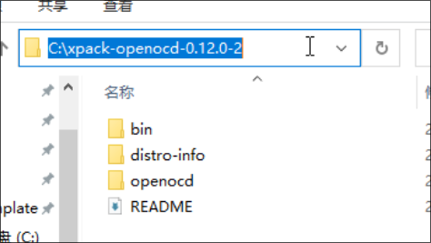
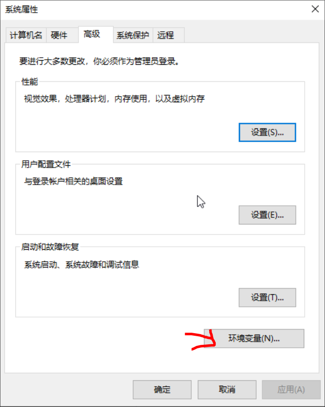
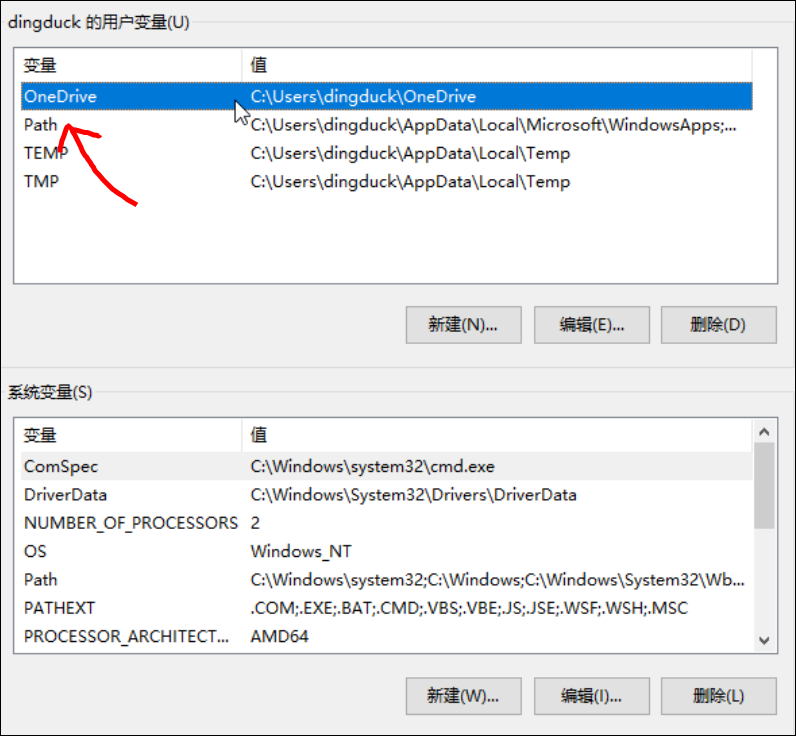
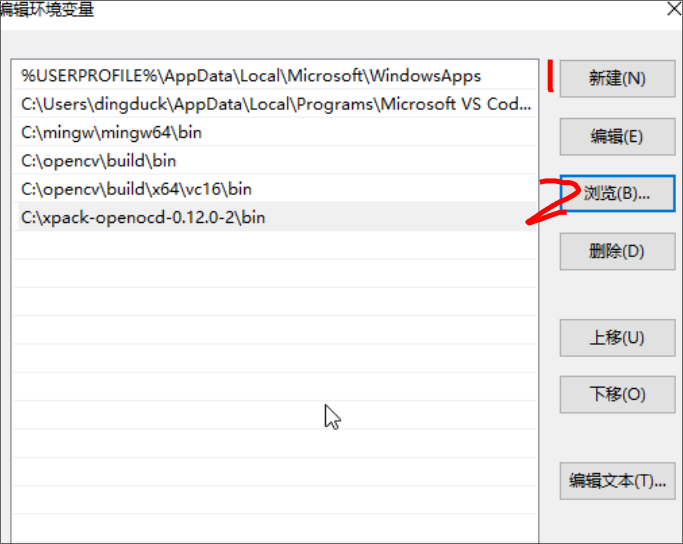
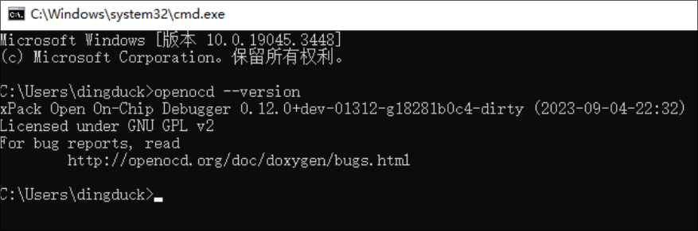

# 环境配置

## ## Linux

### OpenOCD

这是一款开源的调试软件工具，可以用于芯片烧录和调试

```Bash
# ArchLinux
sudo pacman -S openocd
# Ubuntu/Debian
sudo apt-get intstall openocd

```

其他发行版可以自行搜素是否官方库纳入 `OpenOCD`

[**SourceForge**](https://sourceforge.net/p/openocd/code/ci/master/tree/)

其中 Github 提供 Mingw32 版本 [Github](https://github.com/openocd-org/openocd)

非官方 [Github](https://github.com/xpack-dev-tools/openocd-xpack/releases)

### arm-none-eabi

[GNU Arm Embedded Toolchain](https://developer.arm.com/downloads/-/gnu-rm)

为 Arm 设备的 GNU 嵌入式工具链

```bash
# ArchLinux
sudo pacman -S arm-none-eabi-gcc	arm-none-eabi-gdb
# Ubuntu/Debian
sudo apt-get install gcc-arm-none-eabi
```

可移步至[官方下载](https://developer.arm.com/downloads/-/gnu-rm)


### CMake & Make

- CMake 是开源的构建系统生成工具

- Make 一款构建工具， 通过 `Makefile` 文件执行构建

  正常系统都会存在 `make` , `cmake` 需要安装

```bash
sudo pacman -S make cmake # 根据自己系统包管理器， 这两一般都可以通过包管理器直接安装
```


## Window


### OpenOCD

可以通过 `MSYS2` 安装， 但是会比较麻烦

官方提供 [Getting OpenOCD](https://openocd.org/pages/getting-openocd.html)

这里以 [openocd-xpack](https://github.com/xpack-dev-tools/openocd-xpack/releases) 为例, 进入页面下载如下安装包


自己选择解压到的目录， 解压

我解压在 C 盘根目录， 打开解压文件夹， 内容如下



按 `Win` 键输入 `环境`


打开面板， 点击环境变量



双击 `Path` , 一般选择上面那个。上面是用户变量， 下面是系统变量， 修改用户变量只会对用户生效， 修改系统变量对所有用户生效



依次 `新建` -> `浏览` 选择解压 openocd-xpack 下的 `bin` 目录



确定保存

`Win` + `R` 打开命令提示符输入 `openocd --version`

有如下输出即可




### arm-none-eabi

来[这里](https://developer.arm.com/downloads/-/gnu-rm)下载, 根据 `OpenOCD` 安装方式就好，也是配置环境变量


### CMake 和 Make

CMake 直接去官网下载即可 , [链接在此](https://cmake.org/)

Make 在 Windows 上有 MingW提供, 这个是在电脑配置 `C/C++`环境时， 如果你用的不是 VSCode 或者 CLion, 那么请移步配置 `C/C++` 环境

Make 的命令默认为 `mingw32-make` 注意!!!!


现在基本环境就OK了
